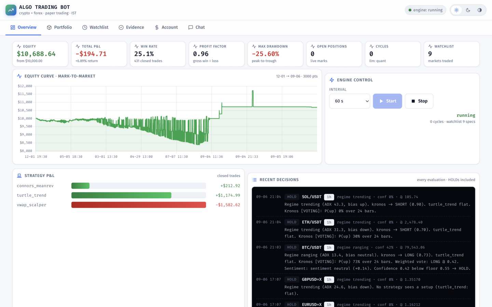
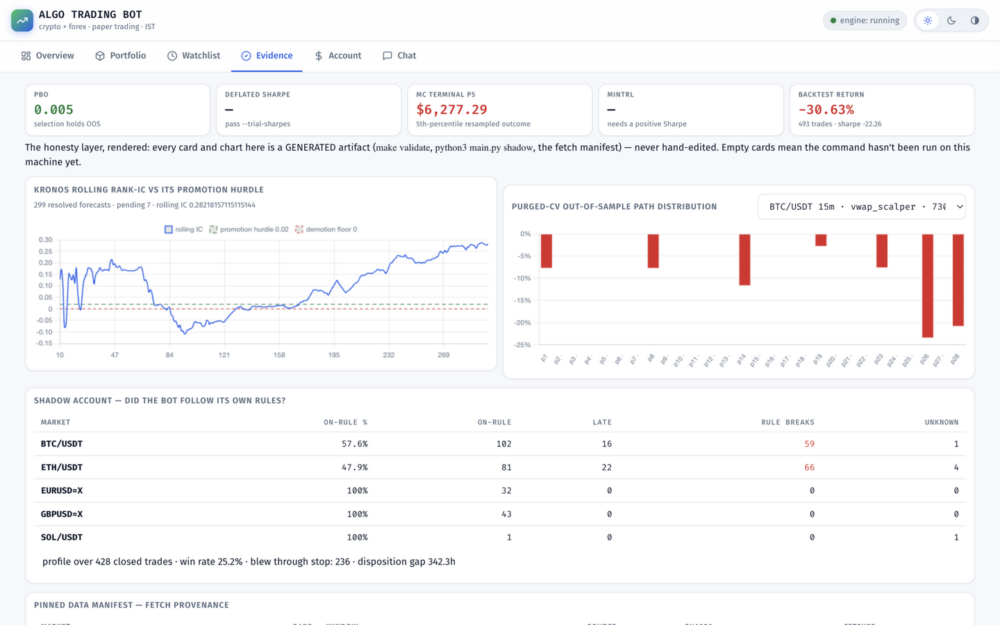
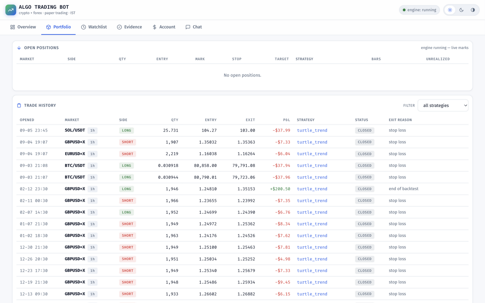

# AI Trading Bot — Crypto, Forex & India NSE (Paper Trading)

[](https://github.com/Varunsai1930/Algo/actions/workflows/ci.yml)
[](LICENSE)

An autonomous trading bot for **crypto and forex** — with a one-click toggle to
**India's NSE** (Nifty 50 + NSE cash equities) — that reads chart data and news,
decides **buy / sell / hold** with written reasoning, sizes and manages positions
by itself — plus a live **dashboard** (equity curve, trade history, strategy
attribution, decision feed, **evidence view**) and a chatbot that answers
questions about its own trading record. A **separate high-frequency paper book**
(`mode='hft'`) trades 1-minute bars with maker-fill simulation, its own fee
tiers, and its own dashboard page — see [HFT.md](HFT.md).

**Why this is different** (each bullet is a measured result, not a claim):

- **Even a foundation model has to earn its vote.** Kronos (AAAI'26) forecasts
  are scored against reality in a rolling IC ledger; it measured **IC −0.056 →
  denied a vote**, and the Evidence tab draws that verdict against its own 0.02
  promotion hurdle.
- **Negative results ship as results.** The RVOL volume filter (published
  Sharpe 0.48 → 2.81 on equities) measured **neutral here → shipped OFF**
  (BACKTESTS.md Round 5); the 5m scalper's −28% cost autopsy is kept, not deleted.
- **The bot audits itself.** The Shadow Account replays every journaled trade
  against its own rules — 236/428 trades *blew through their stop* and the bot
  says so.
- **Fees on both legs of every trade**, taker + slippage on market fills,
  maker pricing on bracket take-profits — and purged-CV / PBO / Deflated-Sharpe
  statistics that quantify how much of the Sharpe is trial-selection.
- **Causality and determinism are tested**, not assumed: truncating history at
  bar *i* cannot change the bar-*i* signal; identical inputs produce identical
  trades. **188 tests**, CI on every push.

Built for a competition with an explicit engineering thesis: **the edge is the
process** — evidence-based strategies (researched from the most profitable
traders in history), honest validation with fees and slippage, strict risk
control, and full attribution of every decision. No strategy here is presented
as "guaranteed profitable" (see [RESEARCH.md](RESEARCH.md) §4).

|  |  |
|---|---|
| **Overview** — live engine, mark-to-market equity, per-strategy P&L, every decision journaled with its reasoning | **Evidence** — Kronos rolling IC vs its own promotion hurdle, purged-CV path distribution, PBO/DSR verdict cards, shadow-account adherence |




```
                    ┌──────────────────────────────────────────┐
 news RSS ─────────▶│ Sentiment overlay (veto/shrink, never     │
                    │ initiates)                                │
 candles (ccxt      │                                          │
 fallback chain /   │ Indicators ─▶ Strategies ─▶ Orchestrator │
 yfinance, closed   │   (RSI/ATR/ADX/   (Turtle,   (regime +    │
 bars only,         │    VWAP/EMA...)  Connors,    weighted    │
 validated+stamped)  │                   Scalper)    vote)      │
                    │                        ▲                  │
                    │    Kronos (probabilistic forecast,        │
                    │     IC ledger — votes only after it      │
                    │     EARNS voting rights)                 │
                    │                     │                     │
                    │  Allocator (skfolio) ─┐│                 │
                    │  risk budget per sym  │▼                 │
                    │              RiskManager (final veto)     │
                    │                     │                     │
                    │              PaperBroker (fees+slippage,  │
                    │               OCO brackets, gap-aware)   │
                    │                     │                     │
                    │              SQLite Journal ────────────────┼──▶ Dashboard
                    └──────────────────────────────────────────┘      (FastAPI + Chart.js)
                                                                    + Chatbot
                     Shadow Account (journal vs its own rules)        + Purged-CV
                     Kronos IC ledger (earned voting rights)           validation
```

## Quick start

```bash
# 1. backtest on real exchange data (no account needed)
python3 main.py backtest --symbol BTC/USDT --timeframe 1h --days 365 --strategy turtle_trend
python3 main.py backtest --symbol ETH/USDT --timeframe 5m --days 30 --strategy ensemble --walk-forward

# 1b. pinned window — byte-identical reruns + a provenance manifest
python3 main.py backtest --symbol BTC/USDT --timeframe 1h \
  --start 2025-01-01 --end 2026-01-01 --strategy turtle_trend

# 2. paper trade (one cycle or forever)
python3 main.py run --once
python3 main.py run                 # loops every 60s, journals everything

# 2b. honesty tooling
python3 main.py backtest --symbol BTC/USDT --timeframe 1h --days 365 \
  --strategy turtle_trend --purged-cv      # OOS path distribution + signal IC
python3 main.py validate --symbol BTC/USDT --timeframe 1h --days 365 \
  --strategy turtle_trend --report REPORT.md   # purged-CV, PBO, DSR, MC + rendered report
python3 main.py kronos --symbol BTC/USDT --days 60  # Kronos IC verdict (earned vote?)
python3 main.py shadow                     # journal vs its own rules

# 3. dashboard + chatbot
python3 main.py dashboard           # → http://127.0.0.1:8000
#   (start/stop the engine from the UI; ask "how much did you earn?",
#    "why did you buy BTC?", "which strategy is best?" — and open the
#    Evidence tab: the honesty layer, rendered)

# 3a-2. Strategy Lab — pick ANY stock/pair, apply strategies, backtest
#    (dashboard: the Lab tab; works for BOTH books via a toggle)
python3 main.py dashboard            # → http://127.0.0.1:8000/#lab
#    crypto/forex/NSE symbols normalize from aliases ("btcusdt", "reliance",
#    "nifty"); "ALL strategies" runs a comparison on one fetched frame;
#    async runs poll /api/lab/status; artifacts land in data/results/lab_*.json

# 3b. the high-frequency paper book (separate account + dashboard tab)
python3 main.py hft-backtest --symbol BTC/USDT --timeframe 1m --days 3 \
  --strategy hft_market_maker            # maker fills, perp fee tier
python3 main.py hft-backtest --triangular --days 3   # the arb monitor (measures its own absence)
python3 main.py hft-battery             # every strategy x symbol x fee tier
python3 main.py hft-run                 # live 1m paper engine (mode='hft')
python3 main.py hft-status              # ALL high-frequency trades, one place
#   (the dashboard's HFT tab has its own engine controls, equity curve,
#    full HFT trade history and decision feed)

# 4. other commands
python3 main.py status              # journal summary (+ pause state)
python3 main.py pause "note"        # manual halt: new entries only, nothing force-closed
python3 main.py resume              # clear the manual pause
python3 main.py market              # show the active market universe (forex | india)
python3 main.py market --mode india # switch to the NSE universe (refused while positions are open)
make test / make lint / make demo / make battery   # common tasks
python3 main.py chat "explain the connors strategy"
python3 main.py seed-demo           # fill journal with real backtest history for the demo
python3 tests/test_bot.py           # 188 tests
```

## The strategies (each mapped to evidence — see RESEARCH.md)

| Strategy | Lineage | Style | Timeframe |
|---|---|---|---|
| **Turtle Trend** | Donchian / Richard Dennis's Turtles + ADX regime filter (SSRN 6272239) | trend-following breakout, 2×ATR stop, opposite-channel exit | 1h |
| **Connors Mean Reversion** | Larry Connors RSI(2) + EMA(200) trend filter (documented ~75% win rate on indices) + Chan AR(1)/OU half-life gate | buy deep pullbacks in uptrends *while pullbacks are actually reverting* (measured half-life ≤ 12 bars), snapback exits, 3×ATR stop + time stop | 4h / 1d |
| **TS Momentum (India)** | Indian momentum papers (SSRN 3345280/3510433/4587697) | long-only absolute momentum: 240-bar return >8% + near 52-week high + EMA200 | 1h / 4h |
| **FX Regime Mean-Rev** | Regime-conditioned FX reversion (SSRN 6087107) | z-score stretch fade with AR(1) half-life regime gate | 1h |
| **HFT trio** (separate book) | Avellaneda-Stoikov 2008, Carver 2025, Zarattini-Aziz 2023 (see HFT.md) | maker market-making, exhaustion fade, micro-breakout + triangular-arb monitor | 1m |
| **VWAP Scalper** | Opening Range Breakout evidence (Zarattini & Aziz 2023, SSRN 4416622) + VWAP institutional benchmark + team's earlier VWAP prototype | VWAP reclaim/loss with momentum + volume confirmation, rolling-range breakout, breakeven trail, time stop; optional time-of-day RVOL filter (tested, off by default — measured neutral on 24/7 crypto, BACKTESTS.md) | 5m / 15m |

**Orchestrator**: classifies each market's regime (ADX + EMA structure) and runs
the strategy registered for that timeframe. Honest caveat: each strategy ships on
its own validated timeframe and the three ranges are **disjoint** (turtle 1h,
Connors 4h/1d, scalper 5m/15m), so every market today has exactly one strategy
owner — the regime-weight blend and the conflict guard are implemented and
journaled, but they only engage if strategies ever share a timeframe. The
orchestration layer's active work today is the Kronos earned-vote gate,
sentiment veto, confidence floors, the risk veto, and full decision journaling.
News sentiment (RSS headlines, LLM-scored if a key is configured,
deterministic lexicon otherwise) can **veto or shrink** a trade but never
initiate one — per the Lopez-Lira & Tang (2023) finding that headline sentiment
is predictive but small relative to costs.

**LLM integration is optional**: with `OPENAI_API_KEY` (or `ANTHROPIC_API_KEY`)
set, the LLM scores news, acts as a tie-breaker/veto, and powers the chatbot's
answers; without a key the bot runs fully deterministic ("quant mode") and the
chatbot answers from the journal with template logic.

## Risk management (the part that survives)

- 1% of equity risked per trade, sized off the ATR stop distance
- **portfolio allocation** (skfolio inverse-volatility by default, HRP optional):
  the risk budget is divided across the symbols that can hold positions, so
  correlated majors (BTC/ETH/SOL) can't each take a full 1% — the whole book
  stays bounded. Per-symbol share is capped (`max_sym_weight`) and floored.
- max 25% notional per position, max 4 concurrent positions
- 3% daily-loss kill switch (plain-language semantics in
  [Risk controls](#risk-controls-what-they-do-and-dont-do) below);
  per-symbol cooldown after a stop-out
- **gross-notional leverage cap** — total open notional across all books plus
  the next entry may not exceed 1.0× equity (the bound the 25% × 4 caps used
  to imply only implicitly, now enforced as one explicit gate across mixed
  timeframes)
- 0.55 minimum confidence for any entry
- R-distance gate: stops wider than 10% of entry price are refused (vol-explosion guard); declared targets below 1.2R are refused
- positions, their stops and the account's cash survive restarts
  (journaled state; a restart continues the equity curve instead of
  silently resetting it to paper capital)
- one position per symbol across timeframes; each (symbol, timeframe)
  book manages only its own position — a 4h bar can never stop out a
  1h trade opened seconds ago

## Risk controls: what they do and don't do

Two independent controls can stop the bot from **opening new positions**.
Neither one ever force-closes anything: open positions always keep their
hard stops, targets and strategy exits while either is engaged.

- **Automatic daily kill switch.** If the account falls 3% below its
  start-of-day equity, new entries are blocked for the rest of the UTC day.
  It resets by itself at the next UTC day — you don't need to do anything.
  It never closes existing positions; their stops, targets and strategy
  exits keep running.
- **Manual pause** — the operator's halt button, completely independent of
  the kill switch (which is equity-triggered and day-scoped). It stays until
  you explicitly resume:

  ```bash
  python3 main.py pause [note]   # e.g. python3 main.py pause "holding over the FOMC"
  python3 main.py resume         # new entries allowed again (all other risk gates still apply)
  python3 main.py status         # shows whether the pause flag is set
  ```

  The same control is a "Pause trading" button on the dashboard (Overview
  tab) with an amber banner while paused. Semantics, in plain words: **new
  entries are blocked; open positions (if any) are still managed — stops,
  targets, strategy exits; nothing is force-closed.** The flag is a small
  `trading_paused.json` next to the journal, so it survives engine and
  dashboard restarts; a corrupt/unreadable flag is quarantined and treated
  as **paused** (a flag we can't read must fail toward "not trading", never
  toward trading).

## Markets: Forex ↔ India toggle

The bot trades **one market universe at a time — never both** (the account
model is single-currency: the crypto+forex book is kept in US dollars, the
India book in rupees, and the two books cannot mix). The dashboard's
Overview tab has a two-state switch next to the engine controls:

- **On = Forex active** — the crypto + forex universe (BTC, ETH, SOL on
  1h; BTC and ETH also on 15m and 4h + EUR/USD, GBP/USD on 1h; the
  historical default)
- **Off = India active** — the NSE universe (Nifty 50 + Reliance, TCS,
  HDFC Bank, Infosys, ICICI Bank on 1h; Reliance and TCS also on 4h)

Switching is guarded so nothing is ever silently lost:

- **The orphan guard.** A switch rewrites the watchlist, so an open position
  whose market dropped out of the universe would be orphaned — its feed
  gone, its stops never checked again. If any open paper position exists
  (in the live engine *or* the journal), the switch is **refused** and the
  dashboard shows a confirmation dialog: *"You have N open paper positions.
  Switching markets will close them at their last prices so none are left
  orphaned. Blocks nothing else — this only changes which markets the bot
  watches."* Positions are force-closed **only** after you explicitly
  confirm — one click never closes anything by itself. With no open
  positions the switch is immediate.
- **Your choice is remembered.** The mode is persisted in
  `data/market_mode.json` (and `data/watchlist.json` is kept in lockstep —
  the mode is the single source of truth). Restarting the dashboard — or
  the whole machine — keeps the same market; the blue banner at the top of
  every tab always shows which market is active, so a restart can never
  silently flip markets on you.

The CLI equivalent (no dashboard needed):

```bash
python3 main.py market                  # show the active universe
python3 main.py market --mode india     # switch to NSE
python3 main.py market --mode forex     # switch back
```

The CLI refuses the switch outright while open positions exist (close them
first); the dashboard offers the explicit confirm-and-close path above.

**v1 scope, stated honestly:**

- India means **NSE cash equities and indices only** — no options, no
  futures/F&O. There is no options infrastructure in this repo (pricing,
  expiry handling, margining); that is deliberately out of scope, not an
  oversight.
- Supported watchlist kinds: **`crypto` | `forex` | `india`** — but only
  one mode's universe is active at a time; the watchlist is derived state
  of the mode (a hand-edited watchlist that disagrees with the persisted
  mode is normalized back to the mode's universe on boot).
- India market data comes from Yahoo Finance (`RELIANCE.NS` equities,
  `^NSEI` index) with a **conservative regulatory cost stack** (delivery
  STT both legs, 0.03% standing brokerage, exchange/SEBI/stamp/GST; see
  `config.py` and BACKTESTS.md's India section — turtle on NSE 1h is
  cost-dominated at delivery rates, no edge is claimed).
- Trades from a previous market mode stay visible in the journal history
  (it is a record, not a dashboard filter); the bot only *opens* new
  positions in the active market. The Portfolio tab says so in one line.

## Honesty rules (backtester & data)

- decisions on closed bars only — the **still-forming candle is dropped**
  before the engine ever sees it (backtest/live parity; unit-tested)
- fills at next bar's open with slippage; taker fees on every fill
  (crypto 0.10%, forex 0.02%) — per-trade `fees` report the **full round trip**
- **OCO bracket semantics**: stop and target are linked; both inside one bar
  resolves to the stop (conservative); a gap through the stop fills at the
  bar's open (you get the market, not the level)
- stop-loss fills can never be better than the stop level (unit-tested)
- strategy exit signals computed on bar *i*'s close fill at bar *i+1*'s open
  (that close was not tradable at decision time)
- `--walk-forward` reports per-fold out-of-sample stats; **`--purged-cv`**
  (skfolio CombinatorialPurgedCV) produces a *distribution* of OOS paths —
  trades whose label (entry through exit) spans a path boundary are purged,
  and only paths that actually traded count toward the stats
- the daily kill switch follows **simulated bar time** in backtests, not the
  wall clock — the same rule runs in backtest and live
- causality is unit-tested (`test_strategies_never_read_future`): truncating
  history at bar *i* cannot change the bar-*i* signal; determinism is tested
  too (identical inputs → identical trades, curve, stats)
- **data quality**: every OHLCV frame is validated (positive prices, high/low
  bracket the body, sorted unique index) before indicators see it; crypto
  fetches have a **fallback chain** (Binance → Bybit → OKX) so one exchange
  being down never stops the engine; price caliber (raw vs adjusted) is
  stamped on every frame; backtest data is disk-cached per day for
  byte-identical repeat runs

## Kronos — a foundation-model voter that must EARN its vote

`bot/kronos_signal.py` wraps [Kronos](https://github.com/shiyu-coder/Kronos)
(AAAI 2026, MIT): a foundation model pre-trained on K-lines from 45+
exchanges. Every cycle it samples ~30 forecast paths and reports P(up),
expected return, and dispersion — but it **starts as a tracked non-voter**. A rolling rank-IC ledger scores its forecasts against what
actually happened; it joins the orchestrator vote (weight 0.20) only after
60+ resolved forecasts with IC ≥ 0.02, and loses the vote if IC decays.
First measured verdict on BTC 1h: IC −0.06 over 115 forecasts → **not
promoted**. The gate is the point: no signal votes on faith, not even a
foundation model. (`python3 main.py kronos` runs the evaluation.)

## Shadow Account — did the bot follow its own rules?

`python3 main.py shadow` replays every journaled trade against its owning
strategy's exit rules on the same bars and reports:

- **rule adherence** — on-rule vs *late* (lingered after the strategy's exit
  signal) vs *rule break* (discretionary exit with the strategy silent);
- **behavior profile** — R-multiple distribution, disposition effect,
  stop discipline (trades that blew through their initial stop);
- **shadow comparison** — actual journal PnL vs the pure-strategy backtest
  over the same window (the measured cost/value of orchestration).

On the seeded demo journal (see the caveat below) it surfaced: 57.6% adherence
on BTC 1h, 16 lingering exits, 236 trades that blew through their initial stop
distance, and a +342h disposition gap (losers held much longer than winners) —
exactly the diagnostics the attribution story needs.

**Journal labeling**: `seed-demo` writes real backtest replays as `mode='demo'`
rows — badged in the trade history, excluded from the chatbot's paper-record
answers, and skipped by `shadow` by default (`--include-demo` audits them).
Those headline shadow numbers were computed on such seeded replays, not on
trades the live engine took; they demonstrate the tooling, not a live record.

## Layout

```
config.py            all tunables (watchlist, risk, costs, strategy params, allocation)
RESEARCH.md          the evidence behind every strategy + honest limitations
BACKTESTS.md         real-data results across symbols/strategies
main.py              CLI (backtest / run / dashboard / status / chat / kronos / shadow / seed-demo)
bot/
  data.py            ccxt fallback chain (Binance→Bybit→OKX) + yfinance + RSS;
                     OHLCV validation, caliber stamps, forming-bar drop, parquet cache
  indicators.py      Wilder RSI/ATR/ADX, EMA, Donchian, VWAP (session + rolling)
  strategies/        base + turtle + meanrev + scalper + ts_momentum +
                     fx_regime_meanrev + hft (stateless, testable)
  sentiment.py       lexicon + LLM headline scoring; veto/shrink only
  llm.py             optional OpenAI/Anthropic client (auto-detected)
  orchestrator.py     regime detection, weighted vote, conflict guard, Kronos
                      earned vote, LLM guardrails
  risk.py            sizing, caps, kill switch (simulated-clock aware), cooldowns,
                     manual pause flag, gross-notional leverage cap
  pause.py           manual "pause all trading" flag file (entries-only halt)
  allocator.py       skfolio inverse-vol / HRP cross-symbol risk budget
  broker.py          paper fills with fees/slippage; OCO brackets, gap-aware fills
  engine.py          autonomous live loop (journal-recovered positions, Kronos eval)
  backtest.py        event-driven backtester + walk-forward + allocation hooks
  validation.py      purged-CV OOS path distribution + signal IC reports
  kronos_signal.py   Kronos foundation-model signal: probabilistic forecast,
                     IC ledger, earned voting rights
  shadow.py          Shadow Account: rule-adherence replay + behavior profile
  hft/               the separate high-frequency paper book (HFT.md):
                     config factory, perp/spot fee tiers, triangular-arb
                     monitor, harness battery — 1m strategies in
                     bot/strategies/hft.py (maker fills, A-S market maker)
  lab.py             Strategy Lab: pick any symbol, apply registered
                     strategies, backtest — both books (dashboard + CLI)
  calendar.py        NSE session gate (IST clock + holiday list)
  journal.py         SQLite: decisions / trades / equity / chat_log
                     (mode column: 'paper' standard book, 'demo' seeded
                     replays, 'hft' high-frequency book)
  chatbot.py         journal-aware Q&A (LLM or deterministic)
  dashboard.py       FastAPI + Chart.js single-page dashboard (incl. Evidence
                     view: Kronos IC ledger, purged-CV paths, PBO/DSR verdicts,
                     shadow adherence, data manifest)
  report.py          validate --report renderer (generated REPORT.md)
  seed_demo.py       fill the journal from real backtests (mode='demo', badged)
models/kronos/       vendored Kronos model source (upstream MIT license vendored;
                     weights via HF Hub)
HFT.md               the high-frequency paper book: research grounding,
                     fee math, strategies, harness, measured results
tests/test_bot.py    188 tests: indicators, strategies, causality, determinism,
                     risk, broker fills/OCO, allocator, purged CV, Kronos gate,
                     shadow, journal, backtest, live-engine regressions
                     (cross-timeframe isolation, restart cash, bars_held)
run_battery.py       full backtest battery across symbols/strategies
scripts/pinned_runs.py  pinned Milestone-A windows (byte-identical reruns)
LICENSE              MIT
pyproject.toml       committed ruff + pytest config (the lint floor CI enforces)
Makefile             make setup / test / lint / backtest / validate / demo / battery
DEMO.md              the 90-second demo runbook + panel Q&A
CHANGELOG.md         rounds 1–6 and the audit hardening, mapped to history
```

## Environment

- Python 3.11+ — `pip install -r requirements.txt`
  (core: `pandas numpy ccxt yfinance fastapi uvicorn requests pyarrow skfolio`;
  Kronos extras: `torch transformers huggingface_hub einops tqdm`)
- Vendor the Kronos model source once: `git clone https://github.com/shiyu-coder/Kronos models/kronos`
- Network access for market data + RSS (no API keys required for data)
- Optional: `OPENAI_API_KEY` / `ANTHROPIC_API_KEY` (LLM mode), `OPENAI_BASE_URL`
- `PAPER_CAPITAL`, `LIVE_INTERVAL`, `BOT_DB_PATH`, `PORTFOLIO_METHOD`,
  `PORTFOLIO_ALLOC`, `MAKER_PRICING` env overrides
- `DASHBOARD_TOKEN` — optional: set it to require `Authorization: Bearer <token>`
  on every dashboard API request (default off; the dashboard binds to 127.0.0.1
  only). The page shell itself loads unguarded and the browser UI prompts for
  the token once, storing it in localStorage.
- `ALGO_NO_AUTO_RESUME=1` — stop the engine auto-resuming on dashboard boot.
  The engine auto-resumes on dashboard restart if it was running when the last
  session ended (a manual stop stays stopped); the UI shows a toast the moment
  a boot-resume happens, so trading never silently begins.
- Without torch or the vendored model, the bot runs normally — Kronos reports
  "unavailable" and never touches the vote

## Status & scope

Paper trading only, by design. The same `MarketSpec` + broker interfaces that
make crypto/forex pluggable are where a real-broker adapter (e.g., Binance
testnet, OANDA practice) would slot in — but going live is a decision that
belongs to a regulated environment, not a competition repo.
