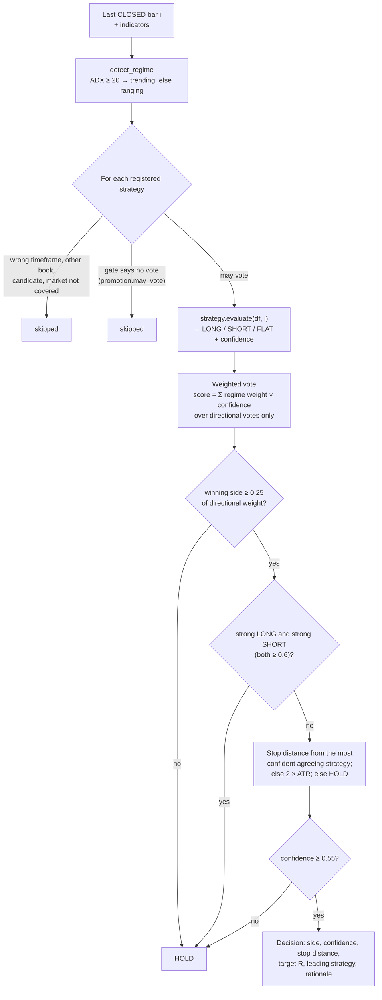
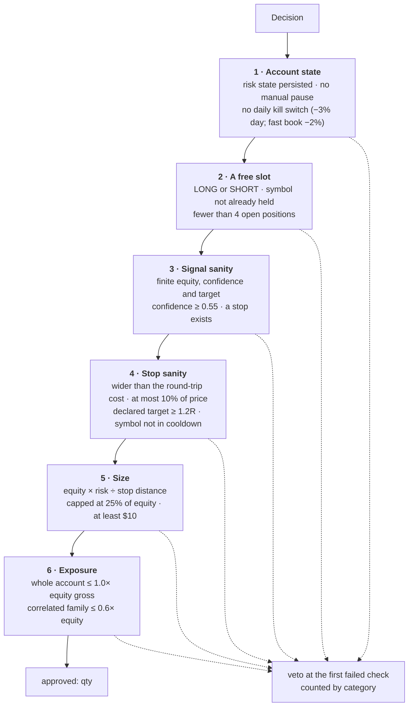
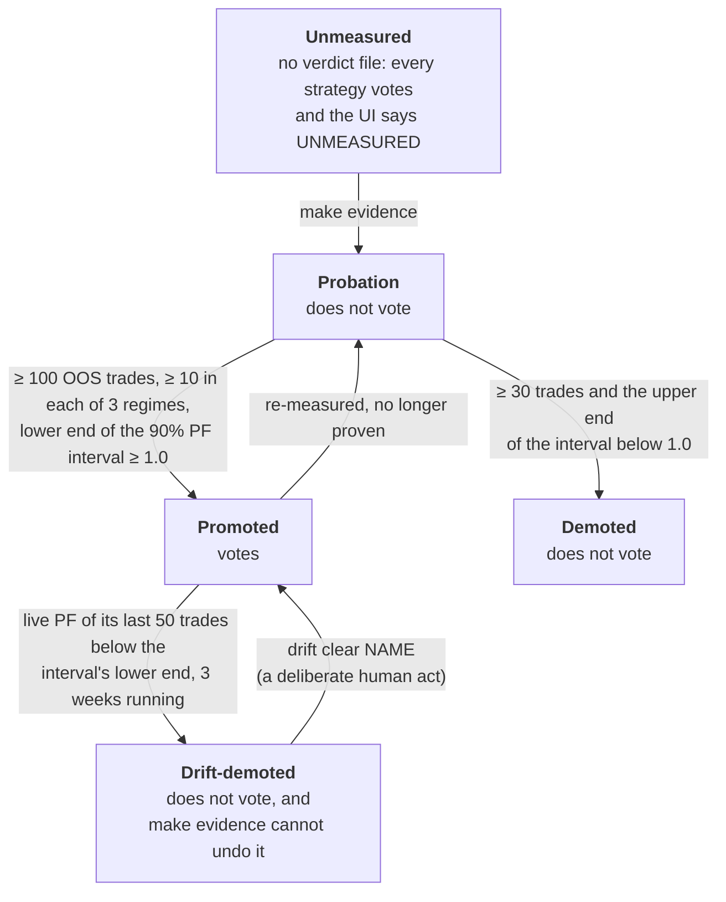
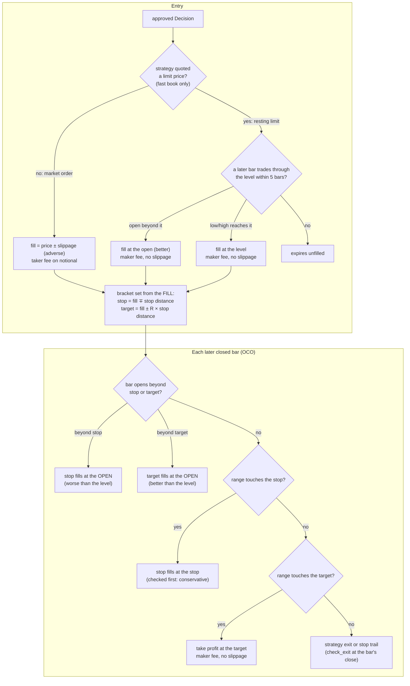

# Architecture: how a candle becomes a trade

*Roadmap M6. Four mechanisms decide everything this bot does: the
**decision path**, the **risk gates**, the **promotion gate** (with the
drift monitor) and the **fill model**. Each section has one diagram, the
rule in words, and the file that implements it. The backtester and the live
engine run the same code for all four (§5).*

## The map

| Step | File | What happens |
|---|---|---|
| Data | `bot/data/` | closed OHLCV bars (the forming bar is dropped), cached |
| Indicators | `bot/indicators.py` | ATR, ADX, EMAs, Donchian, VWAP, RSI on the closed bars |
| Decision | `bot/orchestrator.py` | regime, gate filter, strategy votes → one `Decision` |
| Risk | `bot/risk.py` | ordered vetoes, then position size |
| Fill | `bot/broker.py` | simulated fill, fees, slippage, OCO bracket |
| Cycle | `bot/engine.py`, `bot/positions.py` | one pass per market per cycle; journal-first writes |
| Record | `bot/journal/` | decisions, trades, equity, cash events (SQLite) |

Read in order, one trade runs `bot/data/` → `bot/engine.py` →
`bot/orchestrator.py` → `bot/positions.py` (which calls `bot/risk.py` and
`bot/broker.py`) → `bot/journal/trades.py`, plus the strategy that led it
(`bot/strategies/`).

## 1. The decision path

- **Closed bars only.** The decision for bar *i* sees nothing after bar *i*
  (`scripts/parity_smoke.py` checks that a truncated frame decides the same).
- **The gate is consulted per strategy, per bar.** A strategy that may not
  vote is not even evaluated, so it cannot steer the stop either (§3).
- **Every directional decision leaves bracketed.** If no voting strategy
  supplied a stop, a 2×ATR stop is used; with no usable ATR the decision
  becomes HOLD.
- **No LLM and no news feed** are in this path (removed 2026-09-19): the
  backtester could not replay them.
- **Today's strategies own disjoint timeframes**, so the blend and the
  conflict guard only engage if two voting strategies ever share one.
- The decision is journaled (`decisions` table) whether or not it trades.

## 2. The risk gates

`RiskManager.approve` (`bot/risk.py`) is the last word before any order.
The checks run in this order; the first failure vetoes the entry and is
counted by category (the dashboard shows the counts, so a gate that blocks
everything is visible).

- **Sizing.** Risk per trade is 1% of equity (0.5% on the fast book),
  scaled by the market's share from the allocator (`bot/allocator.py`) and
  by the **drawdown throttle**: half risk from a 10% drawdown, a quarter
  from 20%. The throttle only shrinks size; it never blocks.
- **Kill switch.** Equity is checked every cycle; a day down 3% blocks new
  entries until the next UTC day. Open positions keep their stops and exits.
- **The dust gate** refuses a stop tighter than the modeled round trip
  (taker fee + slippage, both legs): such a trade loses even when right.
- **Gross and cluster caps** see the whole account, both books included:
  BTC, ETH and SOL are one bet, so their family is capped together.
- **Pause** (`main.py pause`) blocks entries only; nothing is force-closed.
- Defaults live in `config.py` (`RiskConfig`, `HFTConfig`); risk state
  (day start, peak, cooldowns) is persisted so a restart cannot reset it.

## 3. The promotion gate and the drift monitor

A strategy's vote is a measurement. `make evidence` runs each book's
pre-registered declaration (`experiments/*.toml`): every strategy walks
forward through 4 folds after full costs, and only out-of-sample trades are
pooled (`bot/experiments.py` → `bot/promotion.py`, rule v2).

- **Only "promoted" votes.** "Not yet disproven" is not enough; this can
  leave a book with nothing allowed to trade, and the Strategies box says so.
- **The interval** is a 90% circular block bootstrap over time-ordered trade
  P&Ls (`bot/evidence_stats.py`); **regimes** are trend up / trend down /
  range from daily ADX and the 200-day SMA's slope, labelled causally.
- **Candidates** never vote whatever their verdict.
- **Drift** (`bot/drift.py`, METHODOLOGY §11): the engine checks every
  promoted strategy's live trades against its expected range at the start
  of each cycle. A drift demotion is overlaid on the verdicts by
  `promotion.load_verdicts`, so the orchestrator, the UI and `config` all
  see it at once.

## 4. The fill model

| Leg | Price | Fee | Slippage |
|---|---|---|---|
| Market entry, stop, signal or manual exit | the price, moved against you | taker: crypto 0.10%, forex 0.02% | crypto 0.05%, forex 0.01% |
| Take-profit (resting limit) | the target, or the better open on a gap | maker: crypto 0.10%, forex 0.01% | none |
| Fast-book limit entry | the level, or the better open | maker | none |

- **OCO.** Stop and target are one bracket; when one fills the position is
  closed and the other is gone.
- **Within a bar the stop is checked before the target.** A bar that spans
  both is scored as a loss: candles cannot say which came first.
- **Gaps.** A stop gapped through fills at the open, never at the better
  stop level; a target gapped through fills at the open, as a real resting
  limit would.
- **The decision bar is never scanned** (the stop was computed from it).
  The fill bar is.
- **Backtest vs live timing.** The backtester fills a market entry at bar
  *i+1*'s open. The live engine fills at bar *i*'s close when its cycle
  runs (within one interval of the close); on 24/7 crypto those are nearly
  the same price. Both then scan bar *i+1* for the bracket; live, that bar
  includes the few seconds before the fill, which can only stop a position
  out earlier than the backtest would, never later.
- **Journal first.** Live, the trade row is written before the simulated
  fill, then completed with the fill-derived stop, target and fee; if the
  fill fails, the row is aborted, so no unbracketed position survives a
  crash.
- **Not modelled:** an order book, partial fills, queue position (a limit
  fills on touch unless `HFT_PENETRATION_BPS` is raised), funding. This is
  why the market maker's "edge" vanished once quotes had to trade through by
  5 bp (RESULTS.md), and why market making cannot be measured honestly here.

## 5. Live equals backtest

`bot/backtest.py` drives the same `Orchestrator`, `RiskManager` and
`PaperBroker` the engine does. `make verify` ends with
`scripts/parity_smoke.py`, which fails the build if:

- a strategy's decision on bar *i* changes when later bars are removed
  (look-ahead);
- the engine's orchestrator and the backtester's decide differently on the
  same bars;
- a fast-book strategy ever votes on the standard book.

## Where to look next

- [METHODOLOGY.md](METHODOLOGY.md): data rules, costs, statistics,
  pre-registration, the ledger check, the drift rule.
- [RESULTS.md](RESULTS.md): what the gate has accepted and rejected so far.
- [TRACK_RECORD.md](TRACK_RECORD.md): the forward record and its limits.
